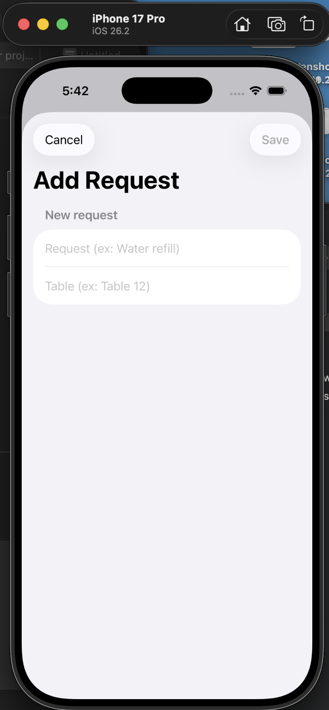

# RestaurantRequests (SwiftUI)

A simple SwiftUI iOS app that tracks restaurant service requests.

## Features
- Request list (New / In Progress / Done)
- Add Request screen with validation
- Detail screen to update status
- SwiftUI NavigationStack + clean UI

## Run locally
Open `RestaurantRequests.xcodeproj` in Xcode and run on an iPhone simulator.

## Screenshots

